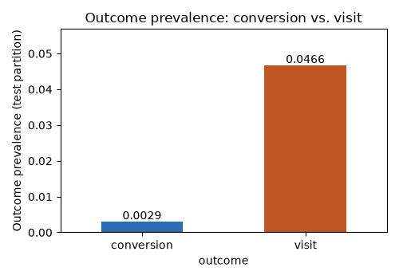
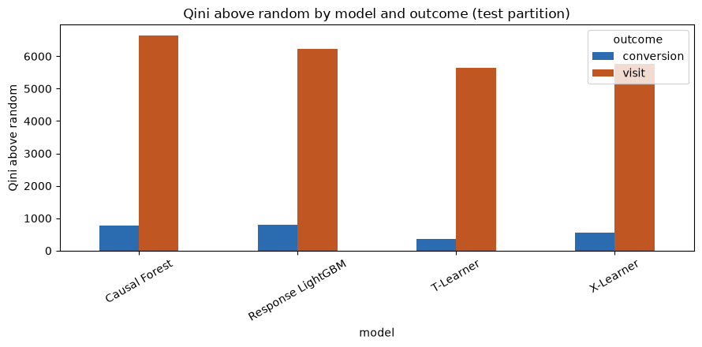
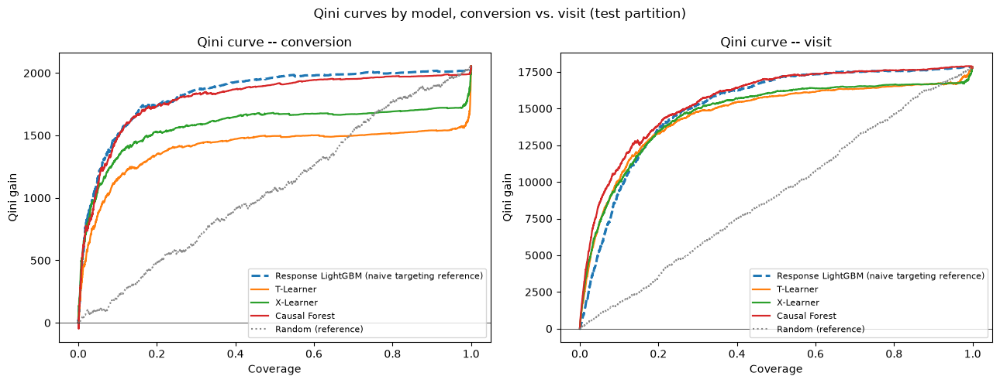
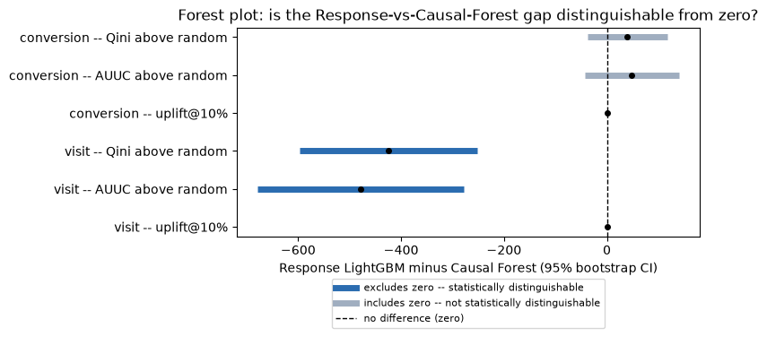

# Does Outcome Sparsity Limit Uplift-Ranking Evidence? A Comparative Analysis on CRITEO-UPLIFTv2.1

*Research memo summarizing a comparative evaluation of causal uplift
estimators on CRITEO-UPLIFTv2.1. All reported statistics are computed
from held-out test-set evaluation artifacts produced by the project's
experimental evaluation pipeline; full analysis code and computational
provenance are available in the accompanying reproducibility
repository.*

## Executive Summary

**The business problem.** An advertiser wants to know which users an ad
actually *changes the mind of* — not just which users are likely to buy
anyway. Ad budget spent on someone who would have converted regardless is
wasted; the useful targeting signal is the *incremental* effect of showing
the ad, not the raw likelihood of the outcome on its own.

**Two ways to target.** A simple approach ranks users by how likely they
are to convert, without regard to whether they were shown an ad — a
*response model* (here, Response LightGBM; formally, this predicts
`P(Y|X)`, the outcome probability given the user's features). A more
sophisticated approach instead tries to estimate each user's actual
incremental response to the ad — an *uplift*, or *causal*, model (here,
T-Learner, X-Learner, and Causal Forest; formally, these estimate the
conditional average treatment effect `tau(X)`). This memo asks whether the
added complexity of the causal approach measurably outranks the simpler
response model, using CRITEO-UPLIFTv2.1.

**What we found.** We compare all four estimators on their ability to rank
users by incremental treatment effect on **conversion**, the primary
business outcome. Conversion is rare (0.29% prevalence), and under it,
Response LightGBM's point-estimate ranking edges out all three causal
estimators, but a paired bootstrap shows this gap is **not statistically
distinguishable from resampling noise** on any of the three ranking metrics
checked: Qini and AUUC (two different ways of scoring how much better than
random targeting a model's ranking is, summed across the whole ranked
list) and uplift@10% (the incremental effect captured if only the top 10%
of ranked users were targeted). This result is genuinely inconclusive, not
evidence that the causal estimators fail to add value.

As a robustness check, we repeat the identical comparison on **visit**, a
much denser behavioral outcome (4.66% prevalence, ~16x conversion's rate) on
the *same* test rows. There, Causal Forest's point-estimate lead over
Response LightGBM **is** statistically distinguishable from noise on all
three metrics. Read together, the two results suggest that the ambiguity
under conversion is consistent with an outcome-sparsity limit on this
comparison's statistical power, rather than evidence that no ranking
difference exists between the response baseline and the causal estimators.

**What this means in practice.** On conversion, the outcome that matters
for the business, this analysis does not give statistical grounds to
prefer either the response baseline or the causal estimators — the honest
position today is that the two approaches are not distinguishable in
expected ranking performance on this outcome, not that one has been shown
to beat the other. This is not a claim that Causal Forest is the better
model in general, that visit substitutes for conversion as the business
objective, or that the bootstrap check establishes a causal mechanism —
see Limitations, and §8 for what a decision maker can and cannot conclude
from this analysis.

## 1. Research Question

An advertiser wants to know for which users an ad *changes* behavior, not
merely which users are likely to act regardless of exposure. Response
LightGBM answers the latter question, `P(Y|X)`, ignoring treatment
entirely. T-Learner, X-Learner, and Causal Forest instead estimate the
conditional average treatment effect, `tau(X) = E[Y(1) - Y(0) | X]`, and
rank users by the effect ad exposure is estimated to have had on them. This
memo asks whether that additional causal machinery produces a measurably
better ranking than the simpler response baseline on held-out data — and
whether any answer to that question is stable across two related but
distinct outcome definitions on the same population.

## 2. Data and Outcome Definitions

Both outcomes are evaluated on the identical seeded 70/15/15
train/validation/test partition of CRITEO-UPLIFTv2.1 (`n_test = 2,096,939`);
only which column is read as `Y` differs.

**Table 1 — Outcome definitions and test-partition prevalence**

| Outcome | Definition | Prevalence (test) | Treatment rate |
|---|---|---|---|
| `conversion` (primary) | User completes a purchase following ad exposure | 0.2917% | 85% |
| `visit` (robustness check) | User visits the advertiser's site following ad exposure | 4.6631% | 85% |

`visit` is ~16.0x more prevalent than `conversion` on the same rows. Every
conversion is preceded by a visit, so visit sits on the same causal path,
one step upstream. A rarer outcome gives every estimator fewer positive
labels per treatment arm to learn from and to be evaluated against — this
is the basis for treating visit as a check on whether conversion's
conclusions are limited by label sparsity, addressed directly in §5–§6.

**Figure 1 — Outcome prevalence: conversion vs. visit**

*Prevalence and treatment-rate figures are computed directly from the
held-out test partition.*

## 3. Experimental Design

**Table 2 — Estimator objectives**

| Estimator | Estimates | Role |
|---|---|---|
| Response LightGBM | `P(Y\|X)` | Non-causal targeting baseline |
| T-Learner | `tau(X)` | Two independent per-arm outcome models, differenced |
| X-Learner | `tau(X)` | Cross-fitted correction of T-Learner's imbalanced-arm bias |
| Causal Forest | `tau(X)` | Honest random forest splitting directly on treatment-effect heterogeneity |

("Cross-fitted" means each user's prediction comes from a model that never
saw that user during training, avoiding the bias of a model grading its own
homework. "Honest" means a tree decides *where* to split the data on one
subset and estimates the effect size on a separate subset, so the same rows
are never used to both pick and score a split.)

All four are scored on the test partition only (never touched during
fitting or model selection) with **Qini above the theoretical random
reference** (how much better than random targeting the model's ranking
does, cumulated as more users are targeted) as the primary ranking
statistic, **AUUC** (Area Under the Uplift Curve — a companion ranking
score built the same way but weighted differently across the ranking) as a
secondary view of the same ranking, and **uplift@K** (the incremental
effect captured if only the top K% of ranked users were targeted) at five
coverage levels.

Section 5's significance check compares **Response LightGBM against Causal
Forest** specifically, using the same pairing under both outcomes.
T-Learner and X-Learner's point estimates are reported in §4 for
completeness but are not carried into the significance check; the
rationale for this specific pairing is given in Robustness and Limitations,
below.

*Full evaluation-protocol and modeling-methodology documentation is
available in the project README.*

## 4. Results

### 4.1 Conversion Outcome

**Table 3 — Model comparison, conversion outcome (test partition)**

| Model | Objective | Qini above random | AUUC above random | uplift@10% |
|---|---|---|---|---|
| Response LightGBM | `P(Y\|X)` | 806.24 | 942.03 | 0.00832 |
| Causal Forest | `tau(X)` | 769.58 | 897.73 | 0.00821 |
| X-Learner | `tau(X)` | 544.11 | 636.21 | 0.00732 |
| T-Learner | `tau(X)` | 369.65 | 430.46 | 0.00634 |
| Random (reference) | — | 47.64 | 56.09 | 0.00117 |

All four models rank users better than random targeting. Response LightGBM
has the highest point estimate on every metric shown; Causal Forest is the
closest causal-model runner-up. Whether this point-estimate gap is real is
addressed in §5, not here — a leaderboard by construction always has a
top row.

**Figure 2 — Qini above random by model and outcome (conversion panel)**

**Figure 3 — Qini curves, conversion panel**

*Figures 2–3 show both outcomes together.*

*Source: held-out test-set evaluation artifacts from the experimental
evaluation pipeline (conversion outcome).*

### 4.2 Visit Robustness Check

**Table 4 — Model comparison, visit outcome (test partition)**

| Model | Objective | Qini above random | AUUC above random | uplift@10% |
|---|---|---|---|---|
| Causal Forest | `tau(X)` | 6642.20 | 7746.52 | 0.06052 |
| Response LightGBM | `P(Y\|X)` | 6226.73 | 7280.12 | 0.05219 |
| X-Learner | `tau(X)` | 5759.00 | 6723.06 | 0.05499 |
| T-Learner | `tau(X)` | 5653.94 | 6591.47 | 0.05592 |
| Random (reference) | — | 186.67 | 219.93 | 0.00976 |

Under visit, Causal Forest's point estimate leads Response LightGBM's on
every metric shown — the ordering of the top two models inverts relative
to §4.1. This table is presented as a check on the conversion result's
reliability, not as a second, independent business finding: visit is not
the outcome the business optimizes for.

*(Figures 2–3 above already show the visit panel alongside conversion.)*

*Source: held-out test-set evaluation artifacts from the experimental
evaluation pipeline (visit outcome).*

## 5. Statistical Evidence

A point-estimate leaderboard always produces a "winner," even when two
models are statistically indistinguishable. We use a paired bootstrap
(500 resamples of the test rows with replacement; the same resample index
applied to both models on each draw) to compute a 95% CI — a confidence
interval, the range that would contain the true gap in about 95 of 100
repeats of this resampling procedure — on the **Response LightGBM minus
Causal Forest** gap, per outcome, for the three metrics shown above.

**Table 5 — Paired bootstrap 95% CI, Response LightGBM minus Causal Forest**

| Outcome | Metric | 95% CI (Response − Causal Forest) | Conclusion |
|---|---|---|---|
| conversion | Qini above random | [−37.85, 117.68] | includes zero |
| conversion | AUUC above random | [−42.90, 139.48] | includes zero |
| conversion | uplift@10% | [−0.00059, 0.00079] | includes zero |
| visit | Qini above random | [−596.53, −252.30] | excludes zero |
| visit | AUUC above random | [−678.75, −277.28] | excludes zero |
| visit | uplift@10% | [−0.01249, −0.00370] | excludes zero |

Under conversion, all three intervals include zero: the data cannot rule
out that the true gap between Response LightGBM and Causal Forest is zero.
Under visit, all three intervals sit entirely below zero, i.e., in Causal
Forest's favor: the observed gap is unlikely to be explained by sampling
variation alone. Because Qini, AUUC, and uplift@10% are constructed from
the same ranking and the same cumulative outcome sums, these three results
should be read as **consistent with one another**, not as three
independent confirmations — no correction for multiple comparisons was
applied, and none was needed to reach that more modest reading.

**Figure 4 — Forest plot: is the Response-vs-Causal-Forest gap distinguishable from zero?**

*Source: paired bootstrap significance analysis from the experimental
evaluation pipeline.*

## 6. Discussion

The two results, read together, suggest that outcome sparsity — not model
choice — is a plausible binding constraint on what this particular
comparison's statistical power can resolve. The same estimators, fit and
scored the same way, on the same rows, produce an inconclusive gap under a
rare outcome and a resolvable one under a ~16x denser outcome on the
identical partition. This is consistent with a rare-event variance
explanation: conversion gives every estimator very few positive labels per
arm to learn from and to be scored against, which widens the bootstrap CI
regardless of whether a true ranking difference exists underneath it.

This explanation should not be treated as proven. It assumes visit is a
denser view of a related estimation problem, rather than a genuinely
different treatment-effect structure that happens to diverge from
conversion's for unrelated reasons — no artifact in this project directly
measures whether visit-ranked and conversion-ranked uplift scores agree
with each other, so that assumption is unverified (see Limitations). The
conversion result should therefore be read as **inconclusive**, not as
evidence that the causal estimators offer no benefit over the response
baseline: a confidence interval that includes zero is consistent with both
"no real difference" and "a real difference too small or too noisy to
detect at this sample size," and the data here cannot distinguish between
those.

T-Learner and X-Learner trail both Response LightGBM and Causal Forest on
point estimates under both outcomes. This memo does not draw a conclusion
about meta-learner estimators in general from that observation — it is
reported for completeness, and no bootstrap check was run on either of
these two models against the others.

## 7. Limitations

- **Offline evaluation only.** Qini/AUUC are computed against the
  historical A/B test's logged outcomes; no online experiment confirms
  that acting on either model's ranking would reproduce the measured
  incremental effect.
- **The sparsity explanation in §6 is an inference, not a verified fact.**
  No artifact measures whether visit-ranked and conversion-ranked uplift
  scores are correlated; it remains possible that visit and conversion
  reflect partially different treatment-effect structures rather than one
  problem viewed at two densities.
- **Bootstrap coverage is partial.** Only the Response-LightGBM-vs-Causal-Forest
  gap was tested, on three (correlated) metrics, per outcome — not
  T-Learner vs. X-Learner, nor any other pairwise comparison.
- **Resample-count and seed sensitivity were not checked.** The bootstrap
  procedure is deterministic given a fixed seed, but how much the reported
  CIs — particularly conversion's, whose bounds sit only moderately from
  zero — would shift under a different seed or resample count was not
  tested.
- **Causal Forest's categorical representation is coarser** than the
  LightGBM-based estimators' (frequency-capped top-8 one-hot vs.
  full-cardinality native categorical splits), a memory/runtime tradeoff
  the comparison does not adjust for.
- **Not a validated causal mechanism.** `f0`–`f11` are anonymized with no
  known business meaning, and the predicted CATE (the conditional average
  treatment effect `tau(X)` defined in §1, under its standard abbreviation)
  is not a true individual treatment effect — both potential outcomes are
  never observed for the same user, so no PEHE (Precision in Estimation of
  Heterogeneous Effect, the standard accuracy check against true individual
  causal effects) against ground truth is reported. The bootstrap
  establishes statistical distinguishability of a ranking-metric gap; it
  does not establish or validate a causal mechanism.
- **Specific to this dataset, these implementations, one hyperparameter
  setting each.** A valid conclusion has the form "under outcome A,
  estimator X ranked better than estimator Y *here*," not a universal
  claim about either an outcome or a method.

## 8. Conclusion

Under conversion, the primary business outcome, Response LightGBM's
point-estimate ranking lead over Causal Forest is not statistically
distinguishable from resampling noise on any metric checked — the
comparison is inconclusive at this sample size, not a demonstrated win for
either the response baseline or the causal estimators. The visit robustness
check, run on the identical rows with a much denser outcome, provides
evidence that this inconclusiveness is consistent with an outcome-sparsity
limit on statistical power, since the same comparison becomes resolvable
once given a denser signal. This is not a claim that Causal Forest is
universally superior, that visit replaces conversion as the business
objective, or that either result establishes a causal mechanism — see
Limitations for what this evidence does and does not support.

**Practical implication.** For a team choosing a targeting approach today,
this analysis does not provide statistical grounds to prefer the causal
estimators over the simpler response baseline on conversion, the metric
that matters for the business — nor does it provide grounds to prefer the
response baseline over them. Neither approach should be presented as
proven better on conversion from this evidence alone. If resolving that
ambiguity matters, the indicated next step is gathering more
conversion-labeled data or extending the observation window — what the
visit robustness check suggests would help is a denser outcome signal, not
a different model choice.

---

## Robustness and Limitations

A careful reader — a technical reviewer, or an adjacent-field researcher
checking this memo's methodology — may reasonably raise the six questions
below. Each is answered here directly, with a pointer to where the same
point is discussed in the main text.

1. **Is the sparsity explanation just an assumption, not a proven fact?**
   Yes, and the memo says so directly: §6 states it as an inference and an
   unverified assumption, not a settled fact, and §7 restates it as a
   named limitation.
2. **Why Response LightGBM vs. Causal Forest specifically, and is that
   pairing cherry-picked?** No — the pairing is fixed identically across
   both outcomes; it is not chosen after seeing which model leads: Causal
   Forest is the runner-up by point estimate under conversion and the
   leader under visit, and the same two models are tested either way.
   Causal Forest is used as the causal-side comparator (rather than
   T-/X-Learner) because it is the most architecturally distinct of the
   three causal estimators — it splits directly on treatment-effect
   heterogeneity rather than differencing two separately-fit outcome
   models, as described in §3.
3. **Are 500 bootstrap resamples enough, and is the result seed-sensitive?**
   This is an open limitation, stated in §7: no evidence exists to rebut
   the concern, so the memo does not claim more precision than was
   actually checked.
4. **Doesn't testing three correlated metrics inflate the chance of a
   false "significant" result?** §5 explicitly frames the three metrics as
   consistent with one another rather than independent confirmations, and
   states no multiple-comparisons correction was applied or needed under
   that framing.
5. **Is the secondary (visit) result being given more weight than it
   deserves?** No — the Executive Summary and §8 both state the conversion
   result first and frame the visit result as informing the conversion
   result's reliability, not as a co-equal second finding.
6. **Is "robustness check" a precise term for what the visit comparison
   does?** This memo uses "robustness check" throughout and deliberately
   avoids the more loaded term "sensitivity analysis" for the visit
   comparison.

Each of the six questions above has either a stated resolution in the main
text or an explicit, honestly-flagged limitation in §7.
